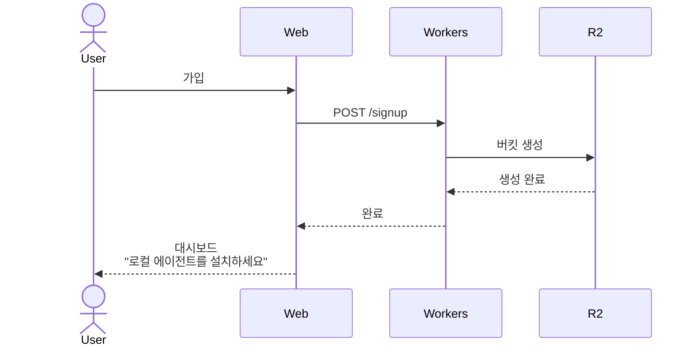
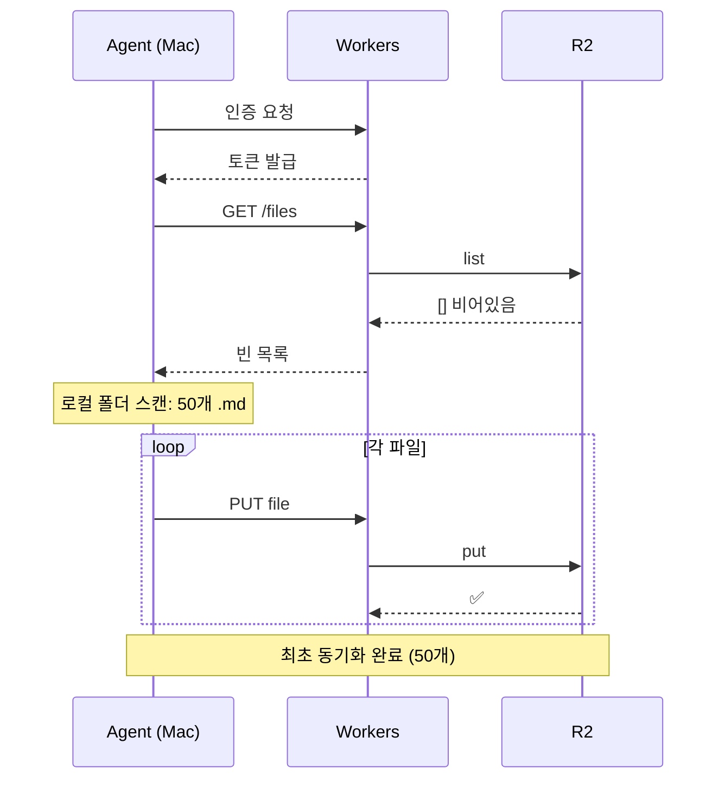
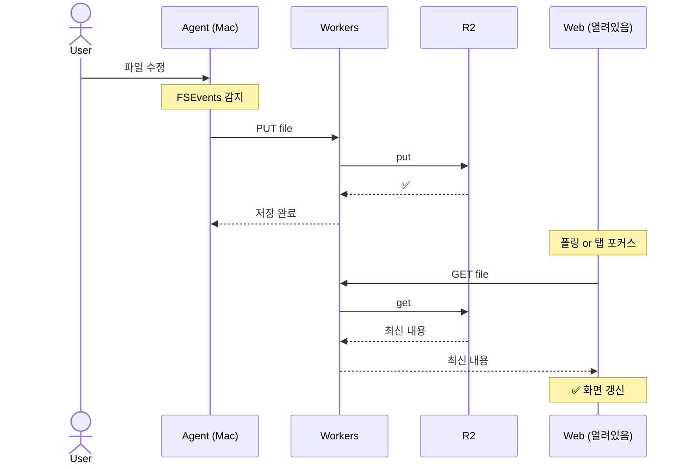
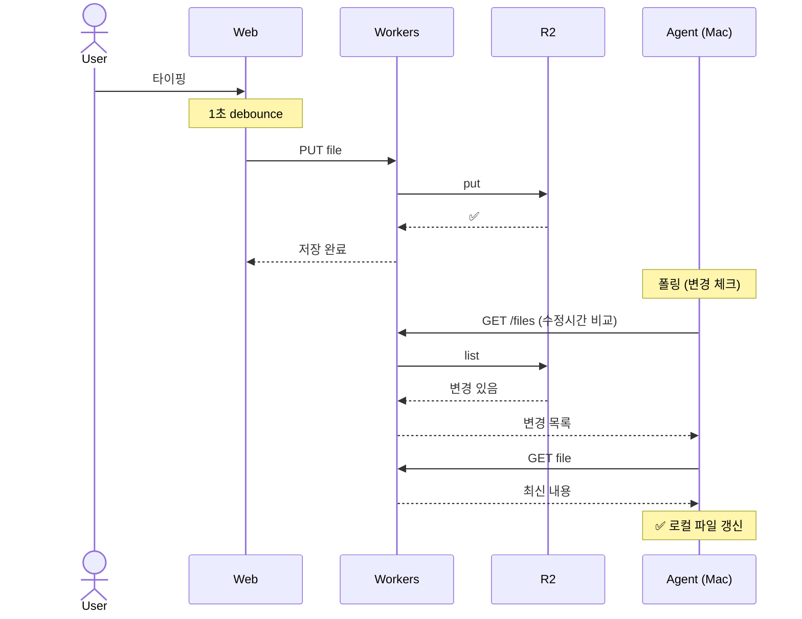
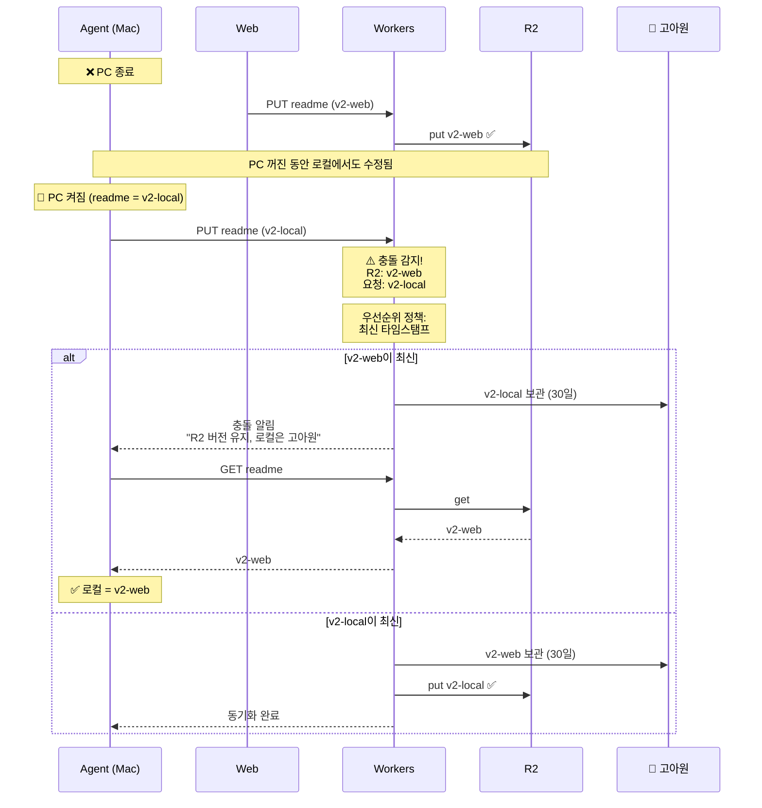
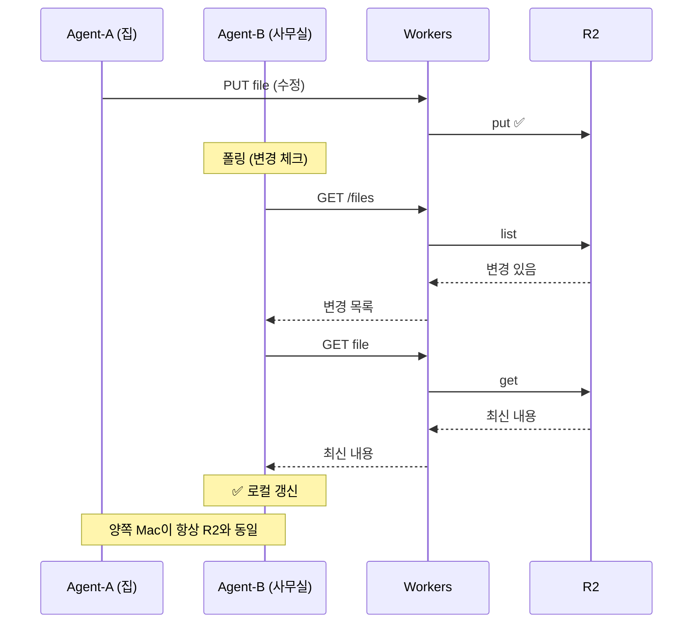
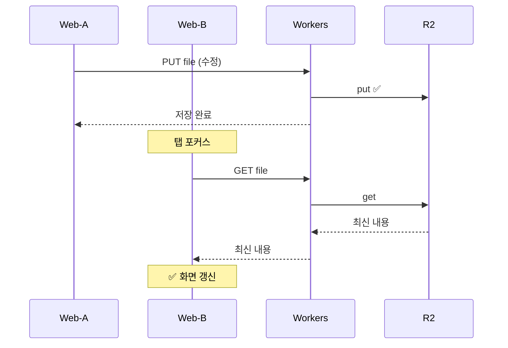

# MDFlare 동기화 시퀀스 다이어그램 (Mermaid)

## 1. 최초 가입 — R2 생성

## 2. 로컬 에이전트 최초 연결 — 전체 업로드

## 3. 로컬에서 파일 수정

## 4. 웹에서 파일 수정

## 5. 로컬 꺼짐 → 웹에서 수정 → 로컬 다시 켜짐

```mermaid
sequenceDiagram
    participant Agent as Agent (Mac)
    participant Web
    participant Workers
    participant R2

    Note over Agent: ❌ PC 종료

    Web->>Workers: PUT fileA
    Workers->>R2: put fileA ✅
    Web->>Workers: PUT fileB
    Workers->>R2: put fileB ✅

    Note over Agent, R2: ⏳ 3시간 경과

    Note over Agent: 🔌 PC 켜짐 (에이전트 자동 시작)
    Agent->>Workers: GET /files
    Workers->>R2: list (전체 목록 + 수정시간)
    R2-->>Workers: 전체 목록
    Workers-->>Agent: 파일 목록

    Note over Agent: 로컬과 비교

    rect rgb(40, 80, 40)
        Note over Agent: fileA: R2가 최신 → 다운로드
        Agent->>Workers: GET fileA
        Workers->>R2: get
        R2-->>Workers: 내용
        Workers-->>Agent: fileA 내용
        Note over Agent: ✅ 로컬 fileA 갱신
    end

    rect rgb(40, 80, 40)
        Note over Agent: fileB: R2가 최신 → 다운로드
        Agent->>Workers: GET fileB
        Workers-->>Agent: fileB 내용
        Note over Agent: ✅ 로컬 fileB 갱신
    end
```

## 6. 충돌 — 양쪽 동시 수정

## 7. 멀티 로컬 — Mac 2대

## 8. 멀티 웹 — 브라우저 2개

